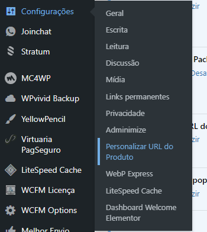
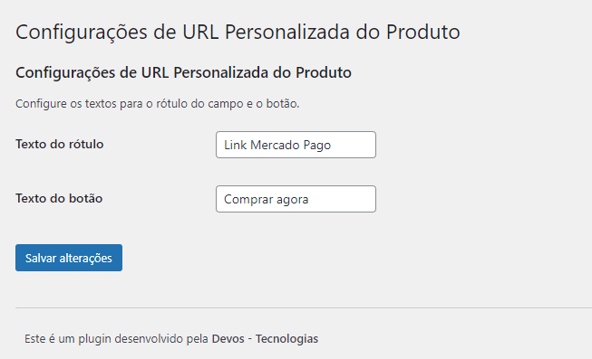
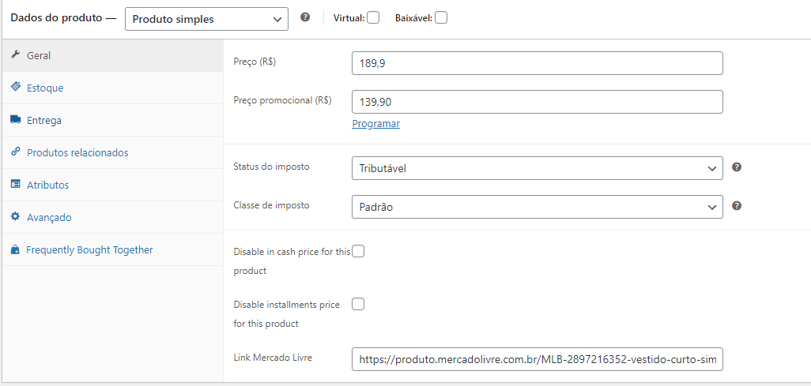

# Personalizar URL para WooCommerce

O plugin Personalizar URL permite personalizar a URL de destino de um produto no WooCommerce. Dessa forma, o usuário pode criar um produto em seu site e direcionar a compra para qualquer outro site, como Mercado Pago, InfinitePay, Mercado Livre, entre outros. Este plugin foi desenvolvido para facilitar e flexibilizar a venda de produtos.

## Funcionalidades

- Personalização da URL de destino de cada produto.
- Interface simples para definir o texto do botão de compra.
- Adiciona um campo na sessão de edição de produto para redirecionar o cliente para o link desejado.

## Requisitos

- WordPress 5.0 ou superior
- WooCommerce 4.0 ou superior

## Instalação

1. Baixe o plugin.
2. No painel administrativo do WordPress, vá para `Plugins` adicione e ative o `Personalizar URL`.

## Uso

### Configuração do Plugin

1. No painel administrativo do WordPress, vá para `Configurações` > `Personalizar URL do Produto`.
    

2. Escolha o texto do label e o botão de compra ao seu gosto.
    

3. Na página de edição do produto, você verá um novo campo para inserir a URL de redirecionamento do botão de compra.
    

4. Salve as alterações.

### Exemplo de Configuração

Suponha que você queira redirecionar os clientes para um link de pagamento do Mercado Pago. Basta inserir a URL do link de pagamento no campo de redirecionamento e definir o texto do botão como "Comprar no Mercado Pago". Salve as alterações e o botão de compra no produto direcionará os clientes para o Mercado Pago.

